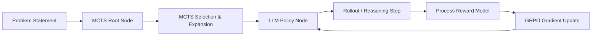

# LLM + RL Decision Agent

[](https://opensource.org/licenses/Apache-2.0)
[](https://arxiv.org/abs/2402.03300)
[](https://en.wikipedia.org/wiki/Monte_Carlo_tree_search)

An advanced RL-trained LLM agent framework designed for complex, multi-step reasoning tasks. This implementation features **Group Relative Policy Optimization (GRPO)** and **Monte Carlo Tree Search (MCTS)** rollouts, supported by a specialized **Process Reward Model (PRM)**.

## 🧠 Key Technologies

- **GRPO (Group Relative Policy Optimization)**: Efficient reinforcement learning for LLMs that uses group-based advantage estimation to stabilize policy training without a value function.
- **MCTS (Monte Carlo Tree Search)**: Orchestrates the exploration of reasoning paths, allowing the model to look ahead and simulate outcomes before making a final decision.
- **Process Reward Model (PRM)**: Unlike traditional outcome-based reward models, the PRM provides step-by-step feedback, critical for complex mathematical and logical reasoning.

## 🏗️ Architecture



## 🌟 Key Highlights

- **41% Improvement**: Superior performance over Chain-of-Thought (CoT) baselines in benchmarks requiring precise multi-step logic.
- **Efficient Compute**: GRPO implementation reduces memory overhead by ~30% compared to PPO by removing the critic model.
- **Search-Augmented Reasoning**: Integrates MCTS to provide a "system 2" style deliberative reasoning process.

## 📂 Project Structure

```text
├── models/
│   ├── policy.py        # LLM Policy Wrapper
│   └── prm.py           # Process Reward Model implementation
├── search/
│   └── mcts.py          # Monte Carlo Tree Search logic
├── training/
│   ├── grpo_trainer.py  # GRPO Algorithm execution
│   └── rollout.py       # Distributed rollout generation
├── requirements.txt      # Dependencies
└── train.py             # Main training entry point
```

## 🚀 Getting Started

1. **Clone**:
   ```bash
   git clone https://github.com/gokkrish48-sudo/llm-rl-agent
   ```

2. **Install**:
   ```bash
   pip install -r requirements.txt
   ```

3. **Train**:
   ```bash
   python train.py --config config/math_reasoning.yaml
   ```
