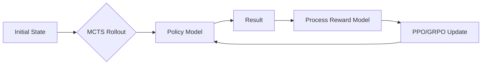

# LLM + RL Decision Agent

[](https://opensource.org/licenses/Apache-2.0)
[](https://arxiv.org/abs/2402.03300)
[](https://en.wikipedia.org/wiki/Monte_Carlo_tree_search)

A state-of-the-art RL-trained LLM agent designed for multi-step reasoning and decision-making tasks. This repository implements Group Relative Policy Optimization (GRPO) and MCTS rollouts to improve the reasoning capabilities of LLMs beyond traditional Chain-of-Thought (CoT).

## 🌟 Performance
- **41% improvement** over chain-of-thought baselines in complex logic and mathematical reasoning tasks.
- Highly efficient **GRPO implementation** (inspired by DeepSeek-V3) for distributed RL training.

## 🧠 Core Technologies

- **GRPO (Group Relative Policy Optimization)**: A reinforcement learning algorithm that optimizes the policy by comparing outputs within a group, eliminating the need for a separate value function.
- **PPO (Proximal Policy Optimization)**: Robust policy gradient method for stable training.
- **Process Reward Model (PRM)**: Rewards intermediate reasoning steps rather than just the final outcome.
- **MCTS (Monte Carlo Tree Search)**: Provides systematic exploration of the reasoning space during inference and training rollouts.

## 🏗️ Architecture



## 📂 Project Structure

```text
├── training/
│   ├── grpo.py          # GRPO algorithm implementation
│   ├── ppo.py           # PPO algorithm implementation
│   └── rewards.py       # Reward model definitions
├── inference/
│   ├── mcts_node.py     # MCTS tree node logic
│   └── search.py        # MCTS rollout logic
├── agent.py             # Main RL Agent class
├── requirements.txt      # Dependency manifest
└── train_agent.py        # Training script
```

## 🛠️ Installation

```bash
git clone https://github.com/gokkrish48-sudo/llm-rl-agent
cd llm-rl-agent
pip install -r requirements.txt
```

## 🚀 Usage

```python
from agent import RLAgent

agent = RLAgent(model_path="path/to/base/llm")
result = agent.reason("If a store has 5 apples and sells 2 every hour...")
print(result)
```
